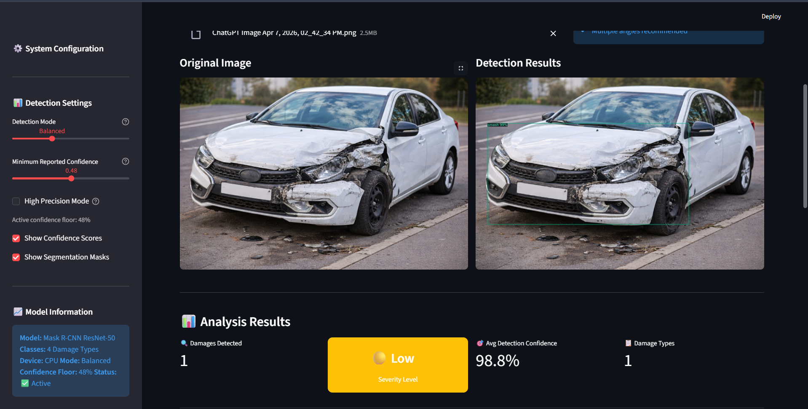

# ADVIS — Automated Deep Visual Inspection System

ADVIS is a Streamlit-based application for vehicle damage inspection and predictive maintenance decision support. It is designed to ingest heterogeneous vehicle-related inputs (images, operational logs, and sensor streams), transform them into ML-ready features, and produce actionable outputs such as damage classification, severity/risk scoring, and maintenance recommendations.

## System architecture overview

The workflow follows a modular pipeline:

Input Data → Data Preprocessing → Feature Engineering → Hybrid Model (Masked CNN + LSTM + XGBoost) → Prediction Output → Visualization

### 1) Input layer

The input layer is responsible for data acquisition and integration across multiple modalities:

- Vehicle data: mileage, engine status, speed, fuel consumption, maintenance logs, historical events.
- Images: visual inspection photos used to identify physical damage and anomalies.
- Sensor data: IoT/embedded telemetry such as vibration, temperature, pressure, and other diagnostics.

This multi-modal design increases robustness by reducing reliance on any single data source.

### 2) Data preprocessing layer

This layer cleans and standardizes raw inputs so that downstream feature computation and modeling are stable and reliable:

- Data cleaning: remove duplicates, handle missing values, denoise outliers.
- Normalization & scaling: min-max or standard scaling for numeric stability.
- Encoding: convert categorical fields to numeric representations.

### 3) Feature engineering layer

This layer extracts informative representations and selects the most relevant signals for prediction.

- Feature extraction (structured): aggregate and derive features from vehicle data (e.g., rolling averages, event counts, time-since-last-service).
- Feature extraction (time-series): build sequences/windows from sensor streams for temporal modeling.
- Feature extraction (images): a **Masked CNN** is used specifically for **feature extraction** from inspection images.
  - The Masked CNN learns damage-aware visual descriptors (and optionally damage-region masks) that convert raw pixels into compact numeric features.
- Feature selection: remove redundant/irrelevant features to reduce compute cost and improve generalization.

### 4) Hybrid model layer

The core intelligence combines classical ML and deep learning to exploit strengths of each modality:

- **LSTM**: models temporal dependencies in sensor sequences (e.g., progressive vibration patterns before failure).
- **XGBoost**: performs high-quality prediction on structured/tabular features and fused representations.
- **Masked CNN (feature extractor)**: provides image-derived feature vectors that can be fused with tabular and time-series representations.

Fusion can be implemented as concatenation of:

- image features (Masked CNN) +
- sequence embedding (LSTM) +
- engineered vehicle/log features

followed by XGBoost for final classification/regression (damage type, severity, risk score).

### 5) Output layer

The output layer turns model inference into actionable results:

- Predicted damage classification
- Severity / failure risk assessment
- Maintenance recommendations
- Condition monitoring indicators
- Predictive maintenance alerts

### 6) Visualization layer

This layer presents results in a user-friendly way (Streamlit UI), enabling monitoring and decisions via dashboards, charts, and reports.

#### Example output

## Running the app

1. Install dependencies:
   - `pip install -r requirements.txt`
   - On Windows, Detectron2 may require:
     - `pip install "git+https://github.com/facebookresearch/detectron2.git" --no-build-isolation`

2. Start Streamlit:
   - `python -m streamlit run app.py`

3. Open the URL Streamlit prints (commonly `http://localhost:8501`).

## Repository notes

- Large artifacts (e.g., training folders and `*.pth` weights) may be excluded via `.gitignore` to avoid pushing oversized files.
- If you need to version model weights, use Git LFS for `*.pth`/`*.pt`.
