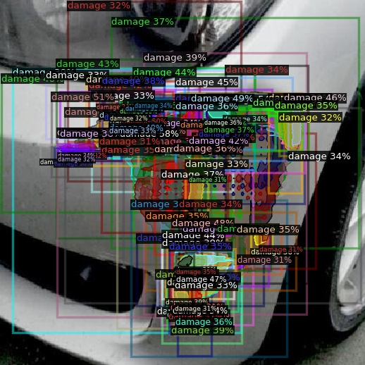

# ADVIS — Automated Deep Visual Inspection System

## Output Screenshot

## Overview
ADVIS is a Streamlit-based web app for vehicle damage inspection. You upload an image, the system analyzes it, and the app presents detection/analysis outputs (counts, confidence, severity summary, and visuals).

> Note on the implementation vs this README
>
> - The current code in this repository (see `app.py`) uses **Detectron2 / Mask R-CNN** for instance segmentation.
> - This README describes a **Hybrid XGBoost–LSTM** approach as the *target / recommended algorithm* for a redesigned pipeline.
>
> If you want the code updated to actually run the Hybrid XGBoost–LSTM pipeline (instead of Detectron2), tell me and I’ll refactor the implementation accordingly.

## Proposed Algorithm: Hybrid XGBoost–LSTM (instead of Mask R-CNN)
A pure Mask R-CNN pipeline is great when you need pixel-level segmentation, but it can be heavy on compute and harder to deploy/maintain on CPU-only environments. A **Hybrid XGBoost–LSTM** approach is a practical alternative when your goal is robust **damage classification / severity estimation** from one or more images and when you can represent the image(s) as compact features.

### High-level idea
1. **Feature extraction (per image)**
   - Convert each image into a fixed-length feature vector using a pretrained vision backbone (e.g., ResNet/EfficientNet/ViT embeddings).
   - This step converts raw pixels → structured numerical features.

2. **Sequence modeling with LSTM (multi-view / multi-angle support)**
   - If you have multiple images per vehicle (front/side/rear, or time-ordered frames), feed the sequence of feature vectors into an **LSTM**.
   - The LSTM learns temporal/view consistency (e.g., “damage present across angles”).

3. **Tabular fusion (optional but common)**
   - Concatenate LSTM outputs with other structured inputs if available:
     - camera angle, lighting score, vehicle type, mileage, accident metadata, etc.

4. **Final prediction using XGBoost**
   - Train **XGBoost** on the fused features for:
     - damage class classification (scratch/dent/broken glass/…)
     - severity scoring (low/medium/high or regression)
     - confidence calibration

### Why this hybrid works well
- **LSTM**: captures dependencies across multiple views/frames (helps when a single image is ambiguous).
- **XGBoost**: excels on structured/tabular features, handles non-linear interactions well, and often provides strong performance on smaller datasets.
- **Deployment-friendly**: the XGBoost head is lightweight; you can choose a CPU-friendly backbone for embeddings.

### Training flow (conceptual)
1. Collect labeled data per vehicle: image set + labels (type/severity).
2. Extract embeddings for each image using a pretrained backbone.
3. Train LSTM to encode an image sequence → a single vehicle-level representation.
4. Train XGBoost on (LSTM representation + optional metadata) → final predictions.
5. Evaluate with metrics like F1 (classification), MAE (severity regression), and calibration (reliability curves).

### Inference flow (conceptual)
1. User uploads one or more images.
2. Generate embeddings for each image.
3. If multiple images: run LSTM to fuse them into a vehicle-level vector.
4. Run XGBoost to predict damage type(s) and severity.
5. Display results in the Streamlit dashboard.

## Running the current app (as-is)
The current Streamlit app uses Detectron2/Mask R-CNN.

1. Install dependencies:
   - `pip install -r requirements.txt`
   - On Windows, Detectron2 may require:
     - `pip install "git+https://github.com/facebookresearch/detectron2.git" --no-build-isolation`

2. Start the app:
   - `python -m streamlit run app.py`

3. Open the local URL Streamlit prints (typically `http://localhost:8501`).

## Repository notes
- Large training artifacts (e.g., `TRAIN/` and `*.pth`) are intentionally excluded from GitHub via `.gitignore` to avoid push failures and GitHub file size limits.
- If you want model weights tracked in the repo, use **Git LFS** for `*.pth`/`*.pt`.
